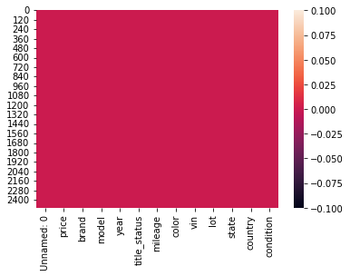
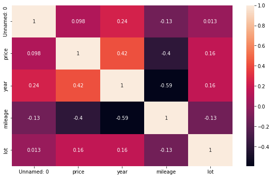
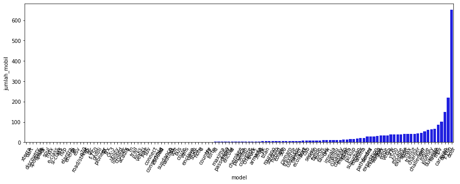
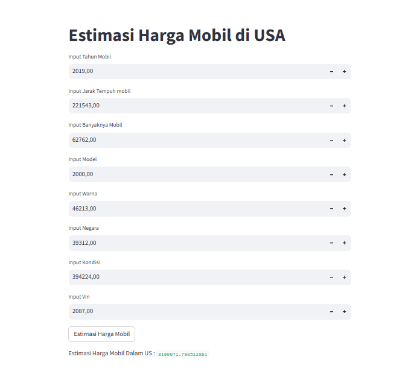

# Laporan Proyek Machine Learning
### Nama : Tri Wahyono
### Nim : 211351145
### Kelas : Malam A

## Domain Proyek

Proyek ini akan fokus pada analisis data yang diperoleh dari dataset "US CARS" yang diambil dari Kaggle. Dataset ini berisi informasi tentang 28 merek mobil bekas yang tersedia untuk dijual di Amerika Serikat. Analisis ini bertujuan untuk mendapatkan wawasan tentang pasar mobil bekas di AS, termasuk tren, merek yang paling populer, faktor yang memengaruhi harga

## Business Understanding

Pasar mobil bekas di Amerika Serikat sangat besar dan beragam, dengan berbagai merek, tahun, dan kondisi kendaraan yang ditawarkan. Proyek ini bertujuan untuk memberikan wawasan tentang pasar ini.

### Problem Statements

Pasar mobil bekas di Amerika Serikat adalah pasar yang besar, tetapi informasi tentang tren, preferensi merek, dan faktor-faktor yang memengaruhi harga tidak selalu mudah ditemukan.

### Goals

Memberikan pemahaman yang mendalam tentang pasar mobil bekas di Amerika Serikat dan menyediakan wawasan yang berguna bagi pembeli, penjual, dan pemangku kepentingan lainnya.

### Solution statements

- Melalui analisis data, penggunaan machine learning jika relevan, proyek ini akan memberikan pemahaman yang lebih baik tentang pasar mobil bekas di Amerika Serikat.
-  Berdasarkan analisis, kami akan menghasilkan laporan mendalam, visualisasi data yang informatif, dan jika memungkinkan, model prediksi harga yang dapat digunakan oleh pemangku kepentingan untuk mengambil keputusan yang lebih baik di pasar mobil bekas.

- Model yang di hasilkan menggunakan metode Regresi Linier

## Data Understanding

Dataset US CARS diperoleh dari Kaggle. Dataset ini berisi informasi tentang mobil bekas di Amerika Serikat dan mencakup 28 merek mobil. Setelah dilakukan pembersihan data, dataset ini berisi sekitar 39.300 baris data dan lebih dari 10 kolom yang mencakup berbagai aspek tentang mobil bekas.

(https://www.kaggle.com/datasets/doaaalsenani/usa-cers-dataset)

### Variabel-variabel pada US CARS  Dataset adalah sebagai berikut:
1. price (float)
2. brand (string)
3. model (string)
4. year (int)
5. title_status (string)
6. mileage (int)
7. color (string)
8. vin (string)
9. lot (string)
10. state (string)
11. country (string)
12. condition (string)


## Data Preparation

## Data Collection
Untuk data collection ini, saya mendapatkan dataset dari kaggle dengan nama dataset US CARS


## Data Discovery And Profiling

Untuk bagian ini, saya menggunakan teknik EDA.<br>

1. mengimport semua library yang dibutuhkan.
``` bash
import pandas as pd
import numpy as np
import matplotlib.pypot as plt
import seaborn as sns
```

2. Memanggil Dataset
``` bash
df = pd.read_csv('USA_cars_datasets.csv')
```

3. Melihat 5 Baris Dataset
``` bash
df.head()
```
4. Melihat Data Dari Masing Masing Kolom Menggunakan Property Info 
``` bash
df.info()
```

5. Memeriksa Dataset 
```  bash
sns.heatmap(df.isnull())
```
 <br>

6. Mendeskripsikan Data
``` bash
df.describe()
```

7. Visualisasi Data Atau Mengexploration Data
``` bash
plt.figure(figsize=(10,6))
sns.heatmap(df.corr(), annot=True)
```
 <br>

8. Dibawah ini adalah jumlah mobil berdasarkan model
``` bash
brands = df.groupby('model').count()[['color']].sort_values(by='color', ascending=True).reset_index()
brands = brands.rename(columns={'color':'jumlah_mobil'})
```

``` bash
fig = plt.figure(figsize=(15,5))
sns.barplot(x=brands['model'], y=brands['jumlah_mobil'], color='blue')
plt.xticks(rotation=60)
```
 <br>

9. Modeling Fitur

    Seleksi fitur
``` bash
fitur = ['year', 'mileage', 'lot']
x = df[fitur]
y = df['price']
x.shape, y.shape
```
((2499, 3), (2499,))

10. Lalu Split Data Training Dan Testing
``` bash
from sklearn.model_selection import train_test_split
x_train, X_test, y_train, y_test = train_test_split(x,y,random_state=70)
y_test.shape
```
(625,)

11. Membuat Regresi Linier
``` bash
from sklearn.linear_model import LinearRegression
lr = LinearRegression()
lr.fit(x_train,y_train)
predik = lr.predict(X_test)
```
12. Mengevaluasi Data
``` bash
nilai = lr.score(X_test, y_test)
print('Akurasi Model Regresi Linier : ', nilai)
```
Akurasi Model Regresi Linier :  0.18981928978314577

13. Membuat Inputan Regresi Linier
``` bash
inputan = np.array([[2019, 22543, 1.6762]])
prediksi = lr.predict(inputan)
print('Estimasi Harga Mobil : ', prediksi)
```
Estimasi Harga Mobil :  [-675373.53194707]

14. Deployment



